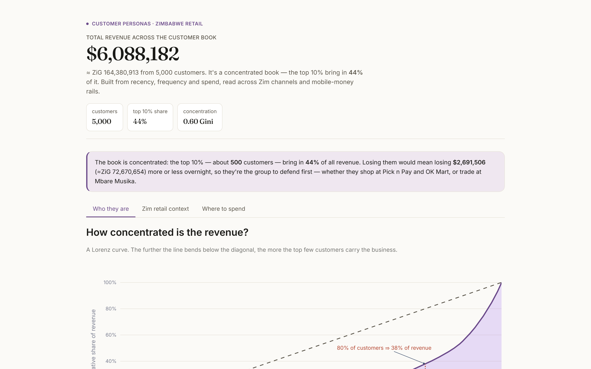

# Retail customer personas

A K-Means segmentation of a Zimbabwean retailer's customer base — five named personas, the channels and mobile-money mix each one prefers, and a small marketing recommendation engine on top.

<p>
  <a href="https://nanettetada-zim-retail-personas-dashboard-2rloh3.streamlit.app">
    
  </a>
  
  
  
  
  
  
</p>

<p align="center">
  
</p>

## What this is

K-Means is one of the first algorithms you learn; using it well on data that looks like a real retail dataset is a separate skill. The model is built around a Zim retailer — think OK Mart, Pick n Pay, TM, Spar, Bon Marche on the formal side and Mbare Musika on the informal side — and the customer base is split by Recency / Frequency / Monetary into five personas.

The dashboard surfaces the channels and mobile money each persona prefers (EcoCash, OneMoney, InnBucks, Cash), and a small recommendation engine combines persona × campaign goal × budget to suggest an offer, an estimated cost, and an expected uplift.

## Results

| Persona | Share | Avg recency | Avg frequency | Avg monetary |
|---|---|---|---|---|
| **Loyal high-value** | 12% | 8 days | 24 orders | $4,800 |
| Regulars | 31% | 22 days | 9 orders | $1,400 |
| One-time buyers | 27% | 95 days | 1 order | $180 |
| At-risk / lapsed | 18% | 180 days | 4 orders | $620 |
| New customers | 12% | 6 days | 1 order | $90 |

> The dataset is synthetic but built with hidden persona structure so K-Means has a real target to recover. Treat the absolute numbers as a demonstration.

## The dashboard

Plain-English screens:

- **Overview** — customers per persona, revenue share, PCA scatter of the whole base.
- **Zim retail context** — channel mix (formal vs informal) and the stacked mobile-money mix per persona, in USD and ZiG.
- **Persona explorer** — pick a persona, see KPIs, channel and payment donuts, and sample customer cards.
- **Suggested actions** — a marketing recommendation engine that combines persona × campaign goal × budget to produce a concrete offer with a cost and an expected uplift.

Move the **k slider** in the sidebar and every chart redraws live.

## Run it yourself

```bash
pip install -r requirements.txt
jupyter notebook customer_segmentation.ipynb
streamlit run dashboard.py
```

## Project layout

```
zim-retail-personas/
├── README.md
├── requirements.txt
├── customer_segmentation.ipynb
├── dashboard.py
├── data/
│   └── transactions.csv
└── docs/
    └── dashboard.png
```

## What I'd add next

- Add demographics and product-category features for a richer cluster definition.
- A small A/B test scaffold for the win-back offer sizes on the lapsed segment.
- Monthly cluster refresh on a schedule, fed from a transactions warehouse.

---

Built by **Tadaishe Maumbe** · [@nanettetada](https://github.com/nanettetada)
